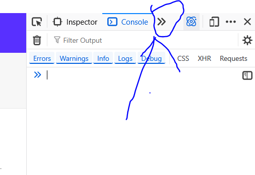
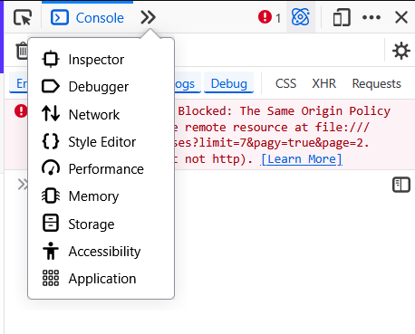
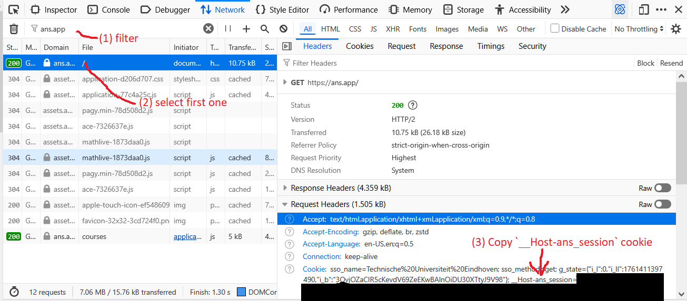
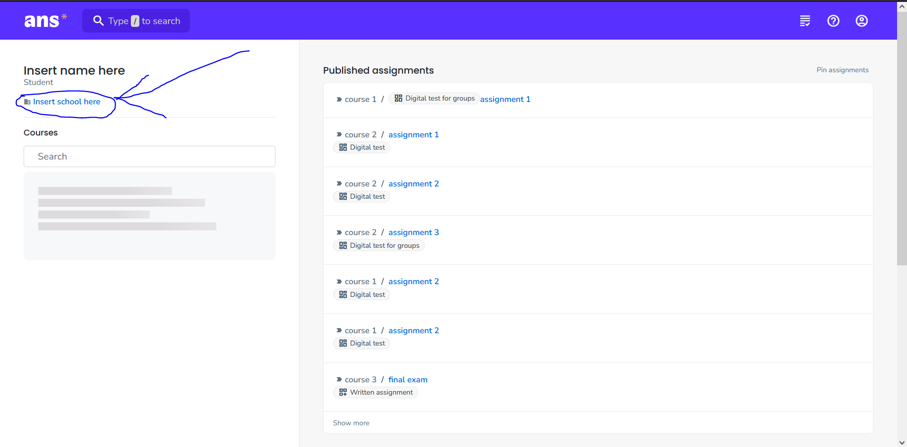
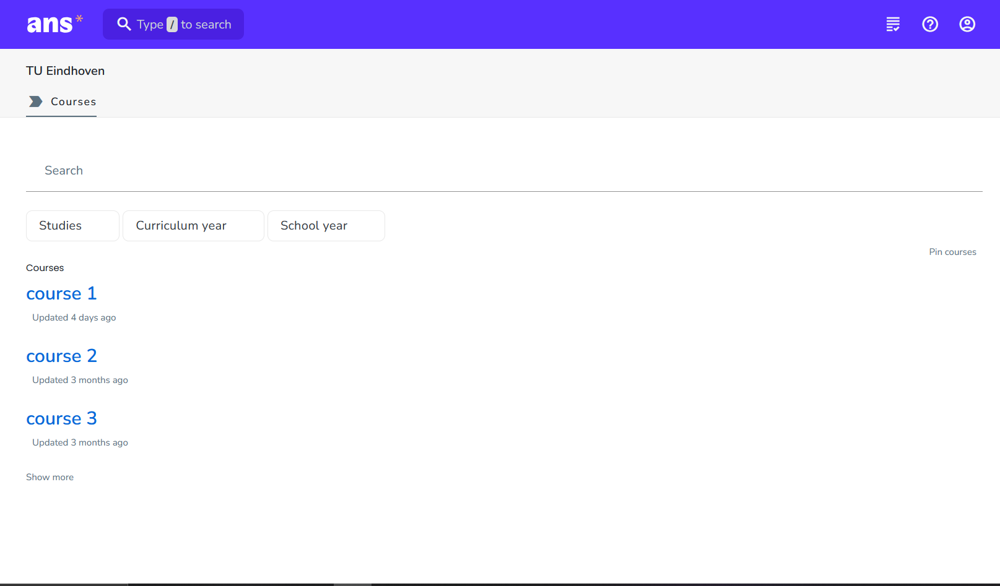

# ANS Archiver

A web scraper for downloading assignment submissions and corrections from the ANS (ans.app) platform. This tool allows students to archive their exam attempts, including PDFs and grading details, since they don't always open their api to student...

## Installation

1. Clone the repository or download the zip file and .
2. Install the packages with either [uv](https://docs.astral.sh/uv/) and run `uv sync` or run `pip install .` inside the cloned directory
3. Set up environment variables in a `.env` file.

## Configuration

Create a `.env` file with:

- `ANS_TOKEN`: Your ANS session token. 
 When you're logged into `ans.app`, open up developer tools with `Ctrl+Shift+I` or `Ctrl+Shift+C` and window like the following below should pop up:
 
 Then you select the network tab, if its not there like in the image above, click on the arrow and click on `Network` to get like below:
 

 1. Filter the output to only `ans.app`
 2. select the top one, below select `Headers`
 3. Scroll all the way down beyond `Request Headers`
 4. Copy everything beyond `__Host-ans_session=`
 

- `COURSES_URL`: The URL where all courses are visible. When you navigate to [ans.app](https://ans.app) when you're logged in, the link of your school typically leads to that url. See image below
 
 which could look like `https://ans.app/universities/1/courses?q=year%3A2025` then the `COURSES_URL` is `universities/1/courses` and everything after the `?` can be ignored. When you go to that url the page should look like the following:
 

- `BASE_PATH`: Directory to save archives (optional, defaults to "archive" in this directory).

So an example `.env` would look like:

```env
ANS_TOKEN="falksfdjsjfojweopifjopwejfopwjopfjopwjfoj"
COURSES_URL="universities/1/courses"
BASE_PATH="C:/Users/username/Documents/school/ans_archive"
```

## Usage

Run the script in the terminal in this directory with: `python ans_submissions_archiver.py` or `uv run ans_submissions_archiver.py`

The tool will:

- Fetch the course names and assignment names.
- Download submissions as PDFs and HTML files with grading panels into their respective `course_name/assignment_name` folder.

## Requirements

- Python 3.13+ or uv in PATH environment variable.
